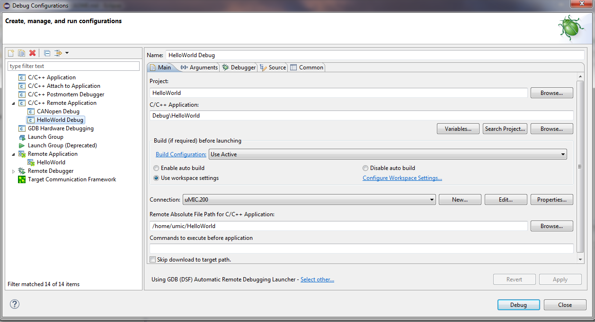

# 'Hello World' Example

This example provides a simple deveopment start on the automation controller
µMIC.200. It prints a greeting string and flashes LED 3 and LED 4.
 

## How to build

Open the project inside the Eclipse workspace and select "Project -> Build Project"
from the menu. 

## How to run

Select "Run -> Run" from the menu or press CTRL+F11.

## How to debug

Select "Run -> Debug Configurations .." from the menu. Open the list inside
"C/C++ Remote application" and select the entry "HelloWorld Debug". Then
start the debug process by clicking on "Debug".

