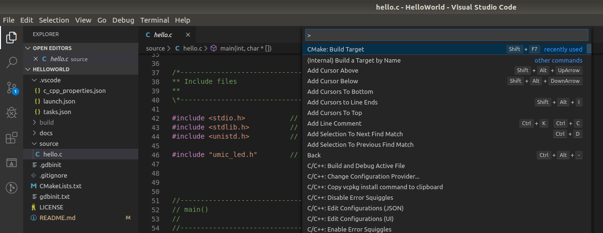
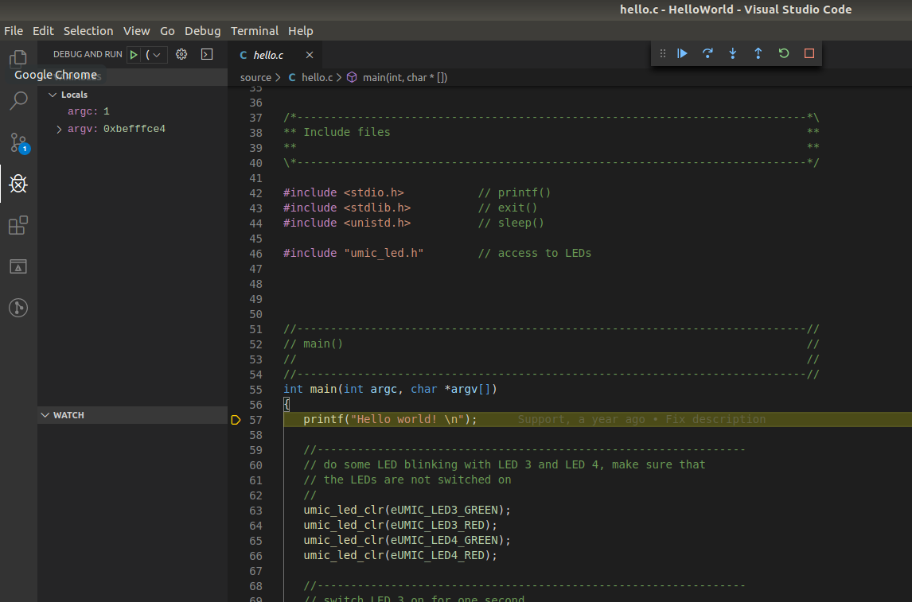

# 'Hello World' Example

This example provides a simple deveopment start on the automation controller
µMIC.200. It prints a greeting string and flashes LED 3 and LED 4.
 

## How to build

Open the project inside Visual Studio Code and select "CMake: Build Target"
from the Command Palette (`STRG + Shift + P`). As alternative you can press
`Shift + F7`. 



## How to run

Copy the program to the µMIC.200 controller by selecting "Terminal -> Run Task..."
from the menu. Start the download by selecting "Copy program". Open the terminal
view in Visual Studio Code (`CTRL + Shift + ´`) and connect to the µMIC.200
controller.

```
ssh umic@umic.200
./helloworld
```


## How to debug

Open the terminal view in Visual Studio Code (`CTRL + Shift + ´`) and connect to the µMIC.200
controller. Start the GDB server on the µMIC.200 controller.

```
ssh umic@umic.200
gdbserver :2345 ./helloworld
```


Select "Debug -> Start Debugging" from the menu or press `F5`. The debugger will start and
set a breakpoint at the first code line of the program.


